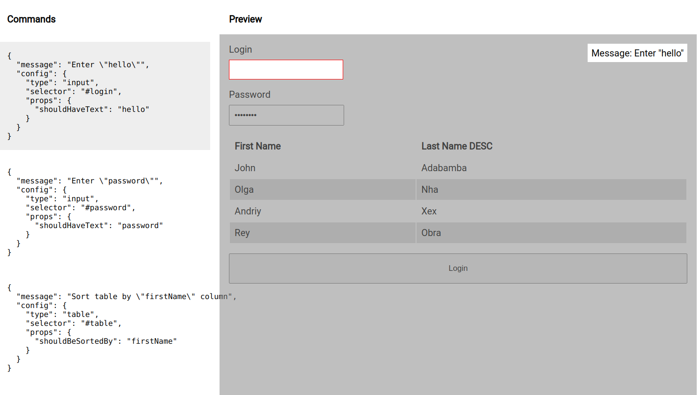
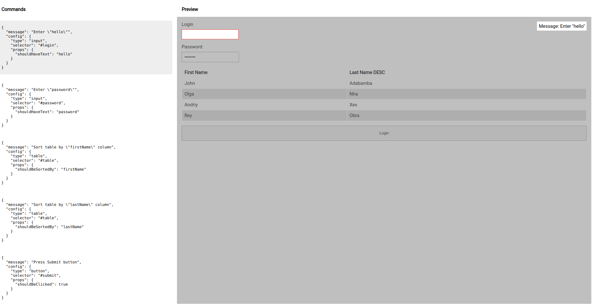

### [demo](https://tooltip-example-app.web.app/)
### You can create tooltips with 2 ways - JSON or with t() function
```
const TOOLTIPS = [
    t('Enter "hello"', page.loginInput().shouldHaveText('hello')),
    t('Enter "password"', page.passwordInput().shouldHaveText('password')),
    t('Sort table by "firstName" column', page.usersTable().shouldBeSorted('firstName')),
    t('Sort table by "lastName" column', page.usersTable().shouldBeSorted('lastName')),
    t('Press Submit button', page.submitButton().shouldBeClicked()),
];
```

<<<<<<< HEAD

=======

>>>>>>> 4c4a4c0f3181ba1d4804a8e2f54527bd97b23a90
